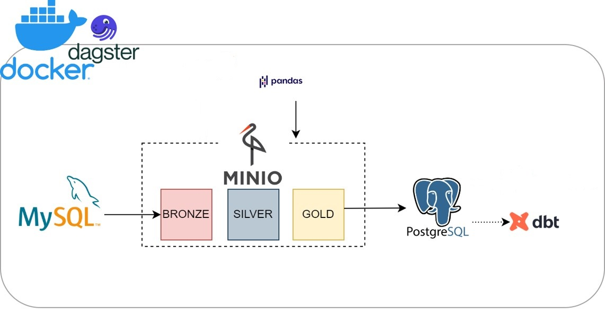
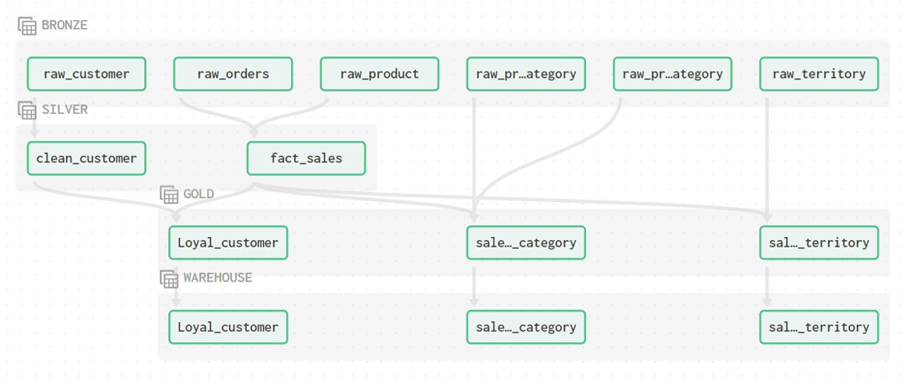

# ETL DATA PIPELINE
# 1. Objective
  - Mục tiêu của project, là với nguồn data có sẵn, phân loại được khách hàng mua hàng , mặt hàng bán chạy và những khu vực bán hàng chạy nhất .
#  2. Design  
## 2.1 Directory tree
- dagster_home: Config cho dagit (dagster UI) và dagster daemon
- dataset: Lưu dataset dưới dạng .csv, mặc định load vào MySQL
- docker-compose: Compose docker containers
- dockerimages: Chứa các image tự build như dagster (dagit + daemon), spark master, streamlit app
- elt_pipeline: Toàn bộ pipeline
- adventure_work: Phân tích cơ bản bằng dbt
- Dockerfile + requirements.txt: Thông tin build image
- env : Lưu biến môi trường (ví dụ POSTGRES_USER MYSQL_USER, …)
- .git + .gitignore: Thuộc git, quản lý code version
- Makefile: Shortcut câu lệnh trên terminal
- load_dataset: Chứa script .sql để tạo schema và load vào database MySQL và Postgres
- requirements.txt: Dependencies của python
## 2.2 Pipeline design

 1. Ta sử dụng docker để đóng gói ứng dụng và dagster để orchestrate assets (theo định nghĩa của daster)
 2. MySQL: Dữ liệu ban đầu có định dạng .csv sẽ được nạp vào cơ sở dữ liệu Mysql
 3. MinIO: xây dựng nền tảng dữ liệu (data lake), trong đó:
   + Bronze: dữ liệu thô được trích xuất từ mysql
   + Silver: làm sạch dữ liệu
   + Gold : dữ liệu dùng để phân tích, sẽ được nạp vào Postgres (Data Warehouse)
 4. Postgres: Data Warehouse
 5. DBT: Dùng cho mục đích phân tích dữ liệu, thường dùng để chuyển đổi dữ liệu khi truy vấn sql phức tạp khi sử dụng thư viện python.
 6. Pandas: Chuyển đổi dữ liệu ở lớp Silver và Gold
## 2.3 Data lineage

 1. Bronze:
   Gồm các asset:
    - raw_customer: Bảng customer từ MySQL
    - raw_orders: Bảng Sales_2015 từ MySQL
    - raw_product: Bảng product từ MySQL
    - raw_productcategory: Bảng Product Category từ MySQL  
    - raw_productsubcategory: Bảng Product Sub Category từ MySQL
    - raw_territory: Bảng territory từ MySQL

 2. Silver
   Gồm các asset:
    - clean_customer: Thay thế khoảng trống bằng NA
    - fact_sales: Kết hợp hai bảng raw_product và raw_orders, tính Total_bill và Profit
  
 3. Gold
   Gồm các asset:
    - loyal_customer:Top những khách hàng có doanh số mua cao
    - sales_by_category:Những mặt hàng bán chạy dựa trên tổng bill và lợi nhuận và được sắp xếp theo ngày
    - sales_by_territory:Những địa điểm bán chạy dựa trên tổng bill và lợi nhuận và được sắp xếp theo ngày
    